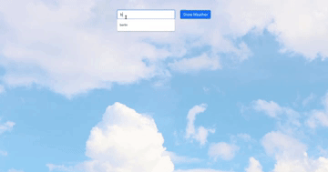

# The Weather App #

This weather application is part of the curriculum of The Odin Project.
The main goal of this project was to learn asynchronous code by sending a request to the Open weather Map website using their API.
The user interface is build using Bootstrap.

How the app works: the user inputs the name of a city and the app returns the current weather in that location.

## Preview ##

